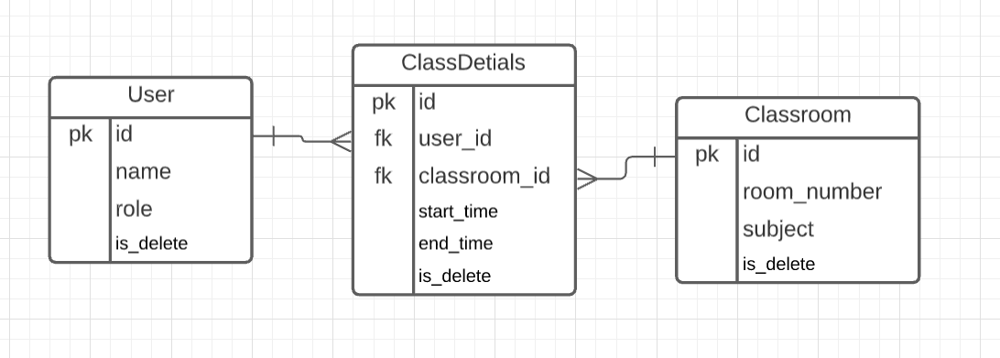
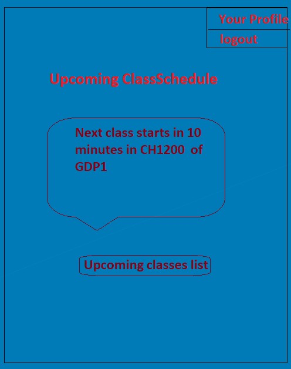
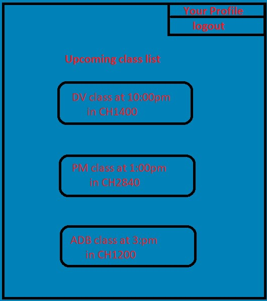
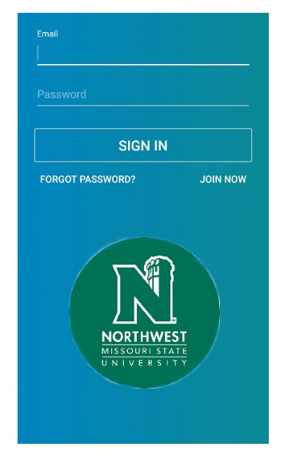

# ClassRemainder
---
## **About this application**
- App contains two screens to display the upcoming classes of student.
- On first screen recent upcoming class with time and room number is displayed in a rectangular box.
- User clicks on box to redirect to second screen.
- Second screen displays list of all upcoming classes with time and room number.

## **Team Members**
1. [HARSHAVARDHAN KURRA](https://github.com/harshakurra123) - Backend Developer
2. [MANOJ NUVVALA](https://github.com/manojnuvvala) - Frontend Developer
3. [SAI KIRAN REDDY ENUGALA](https://github.com/saikiranreddyenugala) - Tester
4. [HEMANTH VENKATA REDDY TELLURI](https://github.com/hemanth8056) - Team Lead

## Requirements
- Python
- Django
- Postgresql
- React js

## Client
Name: Dr. Dennis Case  
Email: dcase@nwmissouri.edu  
Phone: 660.562.1136  

## Database Tables
- User
  - id
  - name
  - role
  - is_delete
- Class Details
  - id
  - user_id
  - classroom_id
  - start_time
  - end_time
  - is_delete
- Classroom Details
  - id
  - room_number
  - subject
  - is_delete

## Entity Relationship Diagram

## API's required
- User - POST, GET, PUT, DELETE
  - POST - API for adding user to the system.
  - GET - API for getting list of Users.
  - PUT - API for updating data of user.
  - DELETE - API for deleting users.

- ClassroomSchedule - POST, GET, UPDATE, DELETE
  - POST - API to schedule a class to the user.
  - GET - API to get the class assosiated to the user.
  - PUT - API to change the class assosiated to the user.
  - DELETE - API to delete class schedule of user.
 
## Schedule Duration
1. Start Date - 18-aug-2021
2. End Date - 31-mar-2022

## Schedule
| Task | Start | End |
| :--- | :----: | ---: |
| Project Plan | 18-aug-2021 | 05-sep-2021 |
| Requirements Gathering | 06-sep-2021 | 05-oct-2021 |
| UI Designs | 06-oct-2021 | 05-nov-2021 |
| Cost & Schedule | 06-nov-2021 | 05-dec-2021 |
| Setup of Project | 12-jan-2022 | 15-feb-2022 |
| Coding | 16-feb-2022 | 28-feb-2022 |
| Testing | 01-mar-2022 | 15-mar-2022 |
| Deployment | 16-mar-2022 | 31-mar-2022 |

## GUI
  ### Screen1
  
  ### Screen2
  
  ### LOGIN SCREEN  
  
  

